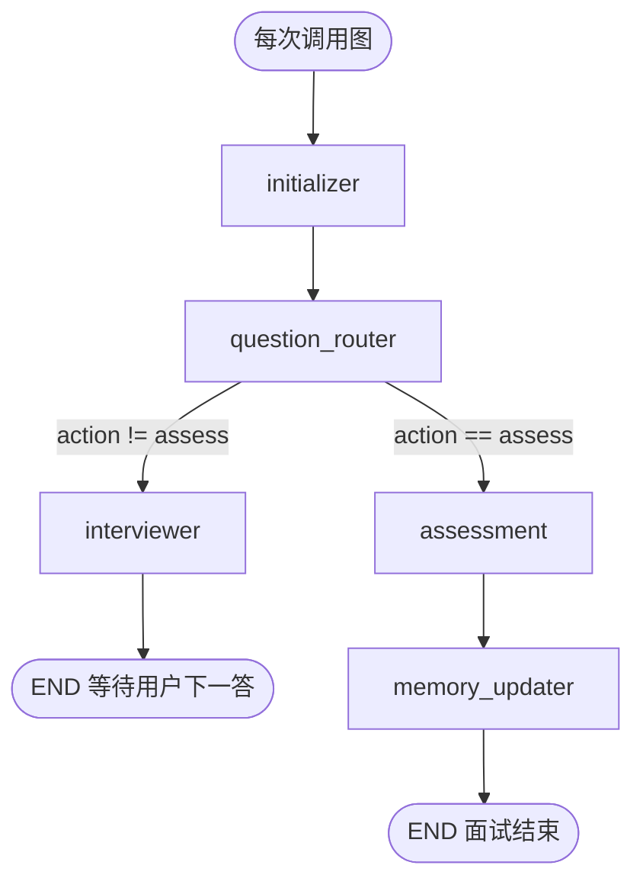

# Agent 节点规格（对齐 interview-agent）

本文描述目标态：本仓库实现 M1/M2/M5 时应达到的节点职责与流程。  
参考代码：`../interview-agent/apps/api/agents/`。

---

## 1. 总览

共 **5 个节点**，共享一份 `InterviewState`。  
每次用户交互（开场 / 提交回答）都会再跑一遍图，入口始终是 `initializer`。



### 条件边规则

| `action` | 含义 | 下一跳 |
|----------|------|--------|
| `initial_question` | 开场第一问 | `interviewer` |
| `follow_up` | 针对上一答追问 | `interviewer` |
| `switch_topic` | 换话题再问 | `interviewer` |
| `assess` | 结束并评估 | `assessment` → `memory_updater` |

图定义对照：`interview-agent/apps/api/agents/interview_graph.py`。

### 一局面试时间线

```text
创建会话
  → 跑图：initializer(装载) → question_router(保持首问) → interviewer(Q1) → END
用户答 A1
  → 跑图：initializer(跳过) → question_router(追问/切题/评估?) → interviewer(Q2) → END
…重复…
达轮次或结束
  → 跑图：… → question_router(assess) → assessment(报告) → memory_updater(写记忆) → END
```

---

## 2. 共享状态 `InterviewState`

对照：`interview-agent/apps/api/agents/state.py`  
本仓库目标文件：`backend/app/agent/state.py`

| 字段簇 | 字段 | 主要写入节点 |
|--------|------|----------------|
| 会话上下文 | `session_id`, `resume_profile`, `job_profile`, `selected_material_ids` | initializer |
| RAG / 记忆 | `retrieved_context`, `weakness_memory` | interviewer / initializer |
| 对话 | `messages`（`add_messages` reducer） | interviewer 追加 AI；API 层追加 Human |
| 控制流 | `action`, `current_topic`, `covered_topics` | router / initializer |
| 计数 | `follow_up_count`, `unclear_count`, `current_round`, `max_rounds` | router / interviewer / initializer |
| 评估产出 | `assessment`, `assessment_status`, `assessment_error`, `memory_updates`, `report_path` | assessment |
| 调试 | `router_source` | question_router |

---

## 3. 节点明细

### 3.1 `initializer` — 装载上下文

| 项 | 说明 |
|----|------|
| 参考文件 | `agents/nodes/initializer.py` |
| 本仓库目标 | `backend/app/agent/nodes/initializer.py` |
| Prompt | 无（不调 LLM） |

#### 流程

```text
进入节点
  ├─ 若 messages 已存在且非空 → 返回 {}（多轮透传）
  └─ 否则（首轮）
       ├─ 按 session_id 读面试会话
       ├─ 会话不存在 → action=assess + error，提前结束链路
       ├─ 加载 resume / job / materials
       ├─ 拉取薄弱点记忆（limit=5）
       ├─ 选择 current_topic（见下方优先级）
       └─ 初始化控制字段并返回 State 补丁
```

#### 要实现的功能

1. **幂等**：已有对话消息时不做重装，避免覆盖多轮状态。  
2. **装载画像与资料**：`resume_profile`、`job_profile`、`selected_material_ids`。  
3. **注入长期薄弱点**：`weakness_memory`，供后续出题优先考弱项。  
4. **选首话题**（优先级从高到低）：  
   - JD `must_have_skills` 第一项 / `domain` / 岗位名  
   - 简历 `potential_questions` / `project_highlights`  
   - 薄弱记忆第一条  
   - 默认话题池（技术栈、系统设计、数据库…）  
5. **重置控制字段**：`action=initial_question`，追问/含糊计数清零，写入 `current_round` / `max_rounds`，清空评估相关字段。

#### 输出（State 补丁）

`resume_profile`, `job_profile`, `selected_material_ids`, `weakness_memory`, `current_topic`, `covered_topics=[]`, `action`, 计数与评估初始值等。

---

### 3.2 `question_router` — 决策下一步

| 项 | 说明 |
|----|------|
| 参考文件 | `agents/nodes/question_router.py`、`prompts/question_router.md`、`schemas/llm_outputs.py`（`RouterDecision`） |
| 本仓库目标 | `backend/app/agent/nodes/question_router.py`、已有 `agent/prompts/question_router.md` |

#### 流程

```text
进入节点
  ├─ 无用户 HumanMessage → 保持 action=initial_question，结束本节点
  └─ 有最新用户回答
       ├─ 尝试 LLM structured output → RouterDecision
       │    失败则 mock_router_decision
       └─ _apply_decision 硬规则覆盖：
            ├─ current_round >= max_rounds → 强制 assess
            ├─ follow_up_count >= 3 → 强制 switch_topic
            ├─ quality 为 unknown/wrong → unclear_count+1；≥2 强制 switch_topic
            ├─ follow_up → follow_up_count+1
            ├─ switch_topic → follow_up_count 清零；若有 next_topic 则更新 current_topic
            └─ 写入 router_source（llm / mock）
```

#### 要实现的功能

1. **首问短路**：尚无用户回答时不乱决策，直接让 interviewer 出开场题。  
2. **质量判断 + 动作选择**：输出 `follow_up` / `switch_topic` / `assess`。  
3. **硬规则兜底**：轮次上限、追问上限、连续含糊，不依赖模型自觉。  
4. **切题时带新话题**：`RouterDecision.next_topic` 写入 `current_topic`。  
5. **可降级**：无 LLM 时用 mock，保证链路可跑。

#### `RouterDecision` 字段（决策 dict）

注意：变量若叫 `action`，则 `action["action"]` 与 `action.get("next_topic")` 是**同一 dict 上的不同 key**：

| key | 含义 |
|-----|------|
| `action` | 下一步动作 |
| `quality` | 上一答质量 |
| `next_topic` | 切题时建议话题（可空） |
| `reason` | 简短原因 |

#### 输出（State 补丁）

`action`, `follow_up_count`, `unclear_count`, `router_source`，可选 `current_topic`。

图条件边：仅当 `action == "assess"` 走 assessment，否则走 interviewer。

---

### 3.3 `interviewer` — 生成下一题

| 项 | 说明 |
|----|------|
| 参考文件 | `agents/nodes/interviewer.py`、`prompts/interviewer.md`、`rag/retrieval.py` |
| 本仓库目标 | `backend/app/agent/nodes/interviewer.py`（可从现有 `interviewer/graph.py` 演进）、已有 `prompts/interviewer.md` |

#### 流程

```text
进入节点
  ├─ 按 action / current_topic 准备出题意图
  ├─ RAG：query = topic + job.domain + 最新用户答
  │        在 selected_material_ids 内检索 top-k → retrieved_context
  ├─ 组装 system prompt（开场/追问/切题 + 资料 + 薄弱点）
  ├─ 带上最近若干轮 messages 调 interviewer LLM（失败则 mock）
  ├─ 只取问题正文 → AIMessage 写入 messages
  └─ current_round += 1 → END（等待用户）
```

#### 要实现的功能

1. **按 action 出题**：开场破冰 / 深入追问 / 平滑切题。  
2. **RAG 注入**：有选中资料时检索并写入 `retrieved_context`，拼进 prompt。  
3. **薄弱点导向**：结合 `weakness_memory`，优先考掌握度低且与岗位相关的点。  
4. **自然语言输出**：只输出问题本身，便于 SSE 展示。  
5. **轮次推进**：每成功出一题 `current_round + 1`。  
6. **可降级**：无 LLM 时用 mock 问题。

#### 输出（State 补丁）

`messages`（新增一条 AI）、`current_round`、`retrieved_context`。

---

### 3.4 `assessment` — 整场复盘

| 项 | 说明 |
|----|------|
| 参考文件 | `agents/nodes/assessment.py`、`prompts/assessment.md`、`schemas/llm_outputs.py`（`AssessmentResult`）、`services/markdown_store.py` |
| 本仓库目标 | `backend/app/agent/nodes/assessment.py`（可从现有 `evaluator/graph.py` 演进）、已有 `prompts/assessment.md` |

#### 流程

```text
进入节点
  ├─ 将 messages 拼成「面试官/候选人」对话文本
  ├─ 优先 structured output → AssessmentResult
  │    失败则 JSON 模式 → 再失败则 JSON 修复 prompt
  ├─ 成功：
  │    ├─ assessment = 结构化结果
  │    ├─ assessment_status = success
  │    ├─ memory_updates = result.memory_updates
  │    └─ report_path = 写 Markdown 报告
  └─ 失败 / 无 LLM：
       assessment_status = failed，带 assessment_error，memory_updates=[]
```

#### 要实现的功能

1. **多维打分**：`total_score` / `tech_score` / `communication_score`（0–100）。  
2. **文字复盘**：`highlights`、`weaknesses`、`suggested_review`。  
3. **产出记忆增量**：每条 `memory_updates` 含 `topic`、`category`、`performance`、`evidence`。  
4. **落盘报告**：Markdown 报告路径写入 `report_path`。  
5. **失败可观测**：不造假高分；无配置或解析失败时明确 `failed`。  
6. **鲁棒解析**：structured → JSON → repair 三级兜底。

#### 输出（State 补丁）

`assessment`, `assessment_status`, `assessment_error`, `memory_updates`, `report_path`。

---

### 3.5 `memory_updater` — 落长期记忆

| 项 | 说明 |
|----|------|
| 参考文件 | `agents/nodes/memory_updater.py`、`services/memory_service.py` |
| 本仓库目标 | `backend/app/agent/nodes/memory_updater.py` |

#### 流程

```text
进入节点
  ├─ memory_updates 为空 → 返回 {}
  └─ 否则调用 memory_service.apply_memory_updates(
         updates, interview_id=session_id
       ) → 写入 knowledge_memories → 返回 {}
```

#### 要实现的功能

1. **副作用写库**：掌握度、暴露/薄弱次数、复习时间等（细节在 memory_service）。  
2. **关联本场面试**：带上 `session_id` 作为来源。  
3. **空更新短路**：评估失败或无更新时不做写入。  
4. **闭环**：下次新面试的 initializer 再读薄弱点注入 State。

#### 输出

通常不改 State（返回 `{}`）；真相在 DB 的 `knowledge_memories`。

---

## 4. 节点与里程碑对应

| 节点 | 最早落地阶段 | 依赖 |
|------|--------------|------|
| interviewer（真 LLM 出题） | M1 | LLM client、会话 messages |
| assessment（真评分 + 报告） | M1 | LLM、会话落库 |
| question_router | M2 | 统一 State、`RouterDecision` |
| initializer | M2（简版）/ M3（含画像） | 会话 + 可选画像服务 |
| memory_updater | M5 | assessment 的 `memory_updates` + memory_service |
| interviewer RAG | M4 | material + retrieval |

建议实现顺序：

```text
统一 InterviewState
  → interviewer + assessment（M1 闭环）
  → question_router + 条件边（M2）
  → initializer 装载（M2/M3）
  → RAG 注入 interviewer（M4）
  → memory_updater（M5）
```

---

## 5. 组图要求（本仓库目标）

推荐新建 `backend/app/agent/interview_graph.py`，拓扑与参考一致：

```text
entry: initializer
initializer → question_router
question_router --(assess)--> assessment → memory_updater → END
question_router --(其它)----> interviewer → END
```

现有 `interviewer/graph.py`、`evaluator/graph.py` 可逐步拆成上述节点后删除或降为兼容包装。
