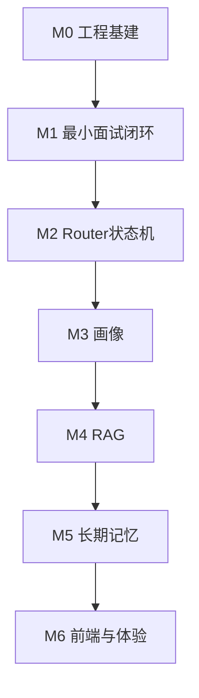

# InterviewAgent 详细补齐计划（含对照文件）

路径约定：
- **本仓库**：`d:\python\InterviewAgent`
- **参考**：`d:\python\interview-agent`（下文路径默认相对该仓库根，或注明 `apps/api/...`）

差距总览见 [gap-analysis.md](./gap-analysis.md)。

---

## 总览



| 阶段 | 目标 | 本仓库主要改动目录 | 参考根目录 |
|------|------|-------------------|------------|
| M0 | 能启动、有依赖文档 | 根目录、`backend/app/config.py`、`database.py` | `README.md`、`.env.example`、`apps/api/requirements.txt` |
| M1 | start→answer→report 真数据 | `api/interview.py`、`agent/*`、`llm/client.py`、`models/*` | `routes/interviews.py`、`services/interview_service.py`、`nodes/*` |
| M2 | 追问/切题/评估路由 | 新建 `agent/nodes/` 或扩展双图 | `agents/interview_graph.py`、`nodes/question_router.py` |
| M3 | 简历+岗位画像 | 新建 services/models/routes | `resume_*`、`job_*` |
| M4 | 资料检索出题 | 新建 `rag/` + material | `rag/*`、`material_*` |
| M5 | 掌握度记忆 | 新建 memory | `memory_*`、`nodes/memory_updater.py` |
| M6 | UI + SSE | 新建 `frontend/` 或 `apps/web` | `apps/web/*` |

| 阶段 | 优先级 | 验收标准 | 状态 |
|------|--------|----------|------|
| M0 | P0 | 服务能启动，`/docs` 可访问 | **已完成** |
| M1 | P0 | 同一 session_id 多轮问答；report 非写死分数；会话落库 | **已完成** |
| M2 | P0/P1 | 能追问、切题、到轮次自动评估；HTTP 驱动图 | **已完成** |
| M3 | P1 | 换不同 JD/简历，首问与考察点明显不同 | **已完成**（LLM 解析 + 关键词 fallback） |
| M4 | P1 | 选中资料后，问题能引用资料内容 | **已完成**（Milvus + SQLite 双库） |
| M5 | P1/P2 | 评估后有记忆；下场优先考弱项 | **已完成**（SQLite + rebuild 重评） |
| M6 | P2 | 浏览器全链路可点通 | **已完成**（真流式 SSE + PDF 上传） |

---

## 当前进度（2026-08-28）

### 已完成

| 模块 | 内容 |
|------|------|
| **M0 基建** | `README`、`.env.example`、`requirements.txt`、`main.py`、async SQLite |
| **M1 面试闭环** | `/interviews` 全接口；`interview_sessions` 持久化；`finish` / `assess` |
| **M2 状态机** | 五节点图 + `question_router` 追问/切题/评估 |
| **M3 画像** | `resume_profiles` / `job_profiles`；`profile_analyzer` LLM + fallback |
| **M4 RAG** | Milvus + DashScope；Markdown 资料；**PDF 文本层上传** |
| **M5 记忆** | `knowledge_memories`；`memory_updater`；**rebuild 重评完整版** |
| **M6 前端** | Next.js 全页面；真流式 SSE；Profile PDF 上传 |
| **Mock LLM** | `llm/mock_llm.py`；无 Key / 调用失败兜底 |

### 二期可选（非阻塞）

| 模块 | 现状 | 说明 |
|------|------|------|
| **PDF vision / queue** | 未做 | 扫描件、异步处理、reprocess |
| **`GET /health`** | 未做 | 探活 |
| **markdown 落盘** | 未做 | 报告 / 画像写文件 |
| **认证** | 未做 | 单用户演示足够 |

---

## 收尾建议

> 功能目标已达成。收尾以「可演示、可提交」为主。

| 优先级 | 任务 | 说明 |
|--------|------|------|
| **P0** | 提交后端未入库改动 | Mock / PDF / 真流式 / rebuild / plan |
| **P0** | 端到端冒烟 | 建档 → PDF → 开面流式 → 报告 → rebuild |
| **P2** | 二期增强 | vision / health / 测试（按需） |

---

## 可选后续

> 以下为体验增强，不阻塞作品集交付。

| # | 任务 | 改哪里 | 状态 |
|---|------|--------|------|
| 1 | PDF vision + 异步队列 | `vision_service` / `material_queue` | 未做 |
| 2 | `GET /health` | `main.py` | 未做 |
| 3 | markdown 落盘 | `markdown_store` | 未做 |
| 4 | `/materials/reprocess` | materials API | 未做 |

---


## M0 — 工程基建

| # | 任务 | 本仓库改哪里 | 对照参考文件 | 状态 |
|---|------|--------------|--------------|------|
| 0.1 | 补 `requirements.txt` | 新建 `InterviewAgent/requirements.txt` | `interview-agent/apps/api/requirements.txt` | 已有（环境 freeze，后续可精简） |
| 0.2 | 补 `.env.example` + README | 新建 `.env.example`、`README.md` | `interview-agent/.env.example`、`README.md` | 已完成 |
| 0.3 | 统一 LLM 配置 `DEFAULT_LLM_*` | `config.py`、`.env`、`model_router.py` | `apps/api/core/config.py` | 已完成 |
| 0.4 | 修正 async SQLite URL、session 工厂 | `backend/app/database.py` | `apps/api/db/client.py` | 已完成 |
| 0.5 | 修 `main.py` 重复路由、启动入口 | `main.py` | `apps/api/main.py` | 已完成 |

**验收**：`uvicorn` / `python -m` 能起服务；`/docs` 可见。

---

## M1 — 最小面试闭环（P0）

### 目标流程（已对齐参考 `/interviews` 前缀）

```text
POST /interviews              → 写库 + 跑图 → 第一题
POST /interviews/{id}/answer  → 读库 → 跑图 → 下一题或 assessment
GET  /interviews              → 历史列表（摘要）
GET  /interviews/{id}         → 会话详情
GET  /interviews/{id}/report  → 评估报告（读 assessment）
```

| # | 任务 | 本仓库改哪里 | 对照参考文件 | 状态 |
|---|------|--------------|--------------|------|
| 1.1 | 对齐并修 State 字段 | `agent/state.py` | `apps/api/agents/state.py` | 已完成 |
| 1.2 | Interviewer 调 LLM 出题 | `agent/interviewer/interviewer.py` | `nodes/interviewer.py` | 已完成 |
| 1.3 | Assessment 结构化评分 | `agent/interviewer/assessment.py` | `nodes/assessment.py` | 已完成 |
| 1.4 | LLM 路由 | `llm/model_router.py` | `model_router.py` | 已完成 |
| 1.5 | 会话落库（`interview_sessions` 宽表） | `models/interview_session.py` | `001_initial_schema.sql` | **已完成** |
| 1.6 | API 真多轮 | `api/interview.py` | `routes/interviews.py` | **已完成** |
| 1.7 | `interview_service` | `services/interview_service.py` | `interview_service.py` | **已完成** |
| 1.8 | `finish` / `assess` | `api/interview.py` | `routes/interviews.py` | **已完成** |
| 1.9 | SSE answer/stream | `api/interview.py` | `routes/interviews.py` | 可选，未做 |

**验收**：同一 `interview_id` 能多轮问答；report 非写死 90 分。

---

## M2 — Router 状态机（P0/P1）

> **节点流程与职责详解**（每个节点做什么、输入输出、硬规则）：见 [nodes-spec.md](./nodes-spec.md)。

### 推荐目标拓扑（对齐参考）

```text
initializer → question_router ├→ interviewer → END
                              └→ assessment → memory_updater → END
```

本阶段可暂不做 `memory_updater`，assessment 后直接 END。

| # | 任务 | 本仓库改哪里 | 对照参考文件 | 状态 |
|---|------|--------------|--------------|------|
| 2.1 | 统一 `InterviewState` | `agent/state.py` | `agents/state.py` | 已完成 |
| 2.2 | `question_router` 节点 | `agent/interviewer/question_router.py` | `nodes/question_router.py` | 已完成 |
| 2.3 | `initializer` 节点 | `agent/interviewer/initiallizer.py` | `nodes/initializer.py` | **已完成** |
| 2.4 | 组图 + 条件边 | `agent/interviewer/graph.py` | `agents/interview_graph.py` | **已完成** |
| 2.5 | answer 驱动图 | `api/interview.py` + `interview_service` | `routes/interviews.py` | **已完成** |
| 2.6 | initializer 加载画像与薄弱点 | `initiallizer.py` + `interview_service` | `nodes/initializer.py` | **已完成** |

**验收**：含糊回答会追问；充分回答会切题；达 `max_rounds` 进入评估。

---

## M3 — 简历 / 岗位画像（P1）

| # | 任务 | 本仓库新建/修改 | 对照参考文件 | 状态 |
|---|------|-----------------|--------------|------|
| 3.1 | Resume/Job ORM | `models/resume_profile.py`、`job_profile.py` | `001_initial_schema.sql` | **已完成** |
| 3.2 | 解析 Schema + Prompt | `agent/schemas/`、`agent/prompts/` | `schemas/resume.py` 等 | **已完成** |
| 3.3 | LLM 解析服务 | `services/profile_analyzer.py` + `resume_service` / `job_service` | 同名参考文件 | **已完成**（`with_structured_output` + fallback） |
| 3.4 | API 路由 | `api/resumes.py`、`api/jobs.py` | `routes/resumes.py` | **已完成** |
| 3.5 | 开场传入 resume_id / job_id | `interview` API + initializer | `schemas/interview.py` | **已完成** |

**验收**：同一套流程，换不同 JD/简历，首问与考察点明显不同。

---

## M4 — 资料 RAG（P1）

| # | 任务 | 本仓库新建/修改 | 对照参考文件 | 状态 |
|---|------|-----------------|--------------|------|
| 4.1 | chunk 切分 | `rag/chunking.py` | `apps/api/rag/chunking.py` | **已完成** |
| 4.2 | embedding | `rag/embeddings.py` | `apps/api/rag/embeddings.py` | **已完成**（DashScope） |
| 4.3 | Milvus 向量检索 + SQLite 取正文 | `rag/milvus_store.py`、`rag/retrieval.py` | `apps/api/rag/retrieval.py` | **已完成** |
| 4.4 | 资料服务 + API | `services/material_service.py`、`api/materials.py` | 参考同名文件 | **已完成** |
| 4.5 | interviewer 注入 retrieved context | `interviewer.py` | `nodes/interviewer.py` | **已完成** |
| 4.6 | PDF/视觉队列 | — | `pdf_service.py` 等 | 未做 |
| 4.7 | 长文本落盘 | — | `markdown_store.py` | 未做 |

**验收**：上传一段技术笔记并选中后，面试官问题能引用笔记内容。

---

## M5 — 长期记忆（P1/P2）

| # | 任务 | 本仓库新建/修改 | 对照参考文件 | 状态 |
|---|------|-----------------|--------------|------|
| 5.1 | knowledge_memories 存储 | `models/knowledge_memory.py`、`schemas/memory.py` | 参考 schema | **已完成** |
| 5.2 | 掌握度更新 / 衰减 / 复习时间 | `services/memory_service.py` | 同名参考文件 | **已完成**（SQLite） |
| 5.3 | assessment 产出 `memory_updates` | `assessment.py` | `nodes/assessment.py` | **已完成** |
| 5.4 | `memory_updater` 节点落库 | `memory_updater.py` | `nodes/memory_updater.py` | **已完成** |
| 5.5 | initializer 注入薄弱点 | `initiallizer.py` | `nodes/initializer.py` | **已完成** |
| 5.6 | memory API + rebuild 重评 | `api/memory.py`、`memory_service.py` | `routes/memory.py` | **已完成** |

**验收**：评估后记忆有记录；下一场面试优先覆盖薄弱知识点。

---

## M6 — 前端与体验（P2）

| # | 任务 | 本仓库新建/修改 | 对照参考文件 | 状态 |
|---|------|-----------------|--------------|------|
| 6.1 | Next 应用骨架 | `apps/web/` | `apps/web/package.json` 等 | **已完成** |
| 6.2 | 画像/资料页 | `apps/web/src/app/profile/` | `profile/page.tsx` | **已完成**（Markdown + PDF） |
| 6.3 | 面试对话页 | `apps/web/src/app/interview/` | `interview/page.tsx` | **已完成**（SSE 流式） |
| 6.4 | 历史 / 能力图谱 | `history`、`skills` | 参考同名页面 | **已完成** |
| 6.5 | API 客户端 | `lib/api.ts`、`lib/sse.ts` | 参考同名文件 | **已完成** |
| 6.6 | 后端 SSE answer/stream | `api/interview.py` | `routes/interviews.py` | **已完成** |
| 6.7 | Mock 降级 | — | `mock_llm.py` | 未做 |

**验收**：浏览器从创建画像 → 开面 → 多轮 → 出报告 → 看记忆，全链路可点通。

---

## 建议目标目录结构

```text
InterviewAgent/
  plan/                 # 本目录
  requirements.txt
  README.md
  .env.example
  main.py
  backend/app/
    api/                # routes
    agent/              # graph + nodes + prompts + state
    services/           # interview / resume / job / material / memory
    rag/                # chunk / embed / retrieve
    llm/                # client + model_router + mock
    models/             # ORM
    schemas/            # Pydantic
    config.py
    database.py
  apps/web/             # Next.js 前端（M6 已完成）
```

---

## 落地原则

1. **先 M0→M1→M2**，再画像/RAG；不要一上来抄 Supabase。
2. 向量检索可先用参考里的 **内存余弦退化路径**（见 `retrieval.py`），跑通再上 pgvector。
3. 双图目录可保留，但会话真相源应在 DB + 统一 State，避免两图字段各写各的。
4. 实现时以 `interview-agent/SYSTEM_DESIGN.md` 为准；`plan.md` 仅作历史参考。
